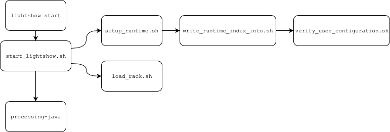
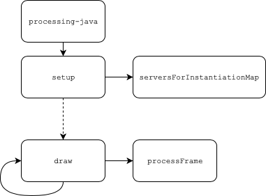

# Program Lifecycle

This document describes what happens under the hood when initializing, running, configuring and ending a light show.

## 1. Initialization

For the user to start using _Live Lightshow_, they first need to initialize their system. This is achieve by calling `lightshow initialize`. This subcommand to `lightshow` itself calls two other scripts.
First `push_program.sh` is called, whose goal it is to compile and upload _StandardFirmata_ to a connected _Arduino_. To get the _Arduino_'s port and FQBN, `arduino_trait.sh` is called. This script is basically just a purpose-specific wrapper over the `arduino-cli`. The call to the `arduino-cli` takes quite long, which is why `arduino_trait.sh` takes quite long. After the traits have been ascertained though, _StandardFirmata_ is compiled and uploaded to the _Arduino_.
After `push_program.sh` completes, `reindex_static.sh` is called. This script creates a new static index with new static configuration files. This has to happen anytime a server changes in any way - and therefore also on first use. The generation of the static index is handeled by a call to `static_index.sh`, which scans the current set of server-files to compile the information. The trait-configurations for the static configuration files are generated and written by `reindex_static.sh` itself.

---

## 2. Startup

While the initialization phase creates the static index, the startup phase generates the runtime index. Calling `lightshow start` is simply a wrapper around calling `start_lightshow.sh`. This script starts by setting up the runtime via `setup_runtime.sh`. Like its static counterpart, this script delegates the generation of the runtime index to another script - in this case `write_runtime_index_into.sh`. This is the script responsible for presenting the user with an interface for specifying their instance-configuration. Validation of the user's configuration is handeled by calls to `verify_user_configuration.sh`. The runtime configuration files are populated by simply copying the corresponding static configuration file. After `setup_runtime.sh` completes, `start_lightshow.sh` continues by creating a _server instantiation map (SIM)_. This is just a list of a specific format, which will be passed to the main _Processing_-program. Before the program can run though, all of the files in the _Servers_ directory are temporarily copied to the _Lightshow_ directory. Now the _Lightshow_-program is compiled and run in the background, with the _SIM_ and the _Arduino_'s port as arguments. After this, the copied server-files are removed from the _Lightshow_ directory again.

---

## 3. Runtime

The startup of the _Processing_-program commences with the call from `start_lightshow.sh` mentioned above. Program execution starts in `Lightshow.pde`'s `setup`-method. This method starts by making sure no window is displayed, creating the objects needed for capturing audio, as well as an _Arduino_ object. It then processes the _SIM_ in `serversForInstantiationMap`. This method first creates `Configuration`-objects from the runtime configuration file paths contained in the _SIM_ and then creates the associated server instances using the configuration objects. The resulting list of server instances is saved globally and used in the main run-loop - the `draw`-method. This method simply gets the current chunk of audio, creates its FFT and passes the results to each created server instance. This process is repeated as long as the program runs.

Whether a light show is currently running or not, can be ascertained by checking the result of `live_pids.sh`. This script returns the PIDs of all currently running processes associated with a _Live Lightshow_. It can therefore be used to determine whether certain subcommands to `lightshow` are currently available or not.
One command available only during runtime is `lightshow status`, which wraps `live_status.sh`. This command displays the current status of the light show, by simply printing certain fields from the _runtime-index_ and runtime configuration files. As runtime-files are not deleted when a light show ends, this script has to be restricted by `lightshow` itself to only be callable at runtime. Otherwise the status of the last light show would be displayed.
The second command available only during runtime is `lightshow configure`, which wraps `configure_server_instance.sh`. This script opens the runtime configuration file of a given server instance for editing. It handles the entire user interaction and asserts the validity of the user-edited configuration by calls to `verify_runtime_configuration.sh`.

---

## 4. Shutdown

Ending a light show is facilitated by a call to `lightshow end`. This will in turn get the light show's processes' PIDs from `live_pids.sh` and kill all corresponding processes. Upon ending a light show, the runtime files remain, but are not accessible by any subcommands to `lightshow`. Creating new static and runtime index- as well as configuration-files will only ever overwrite but never delete previous files.

---

| [← 2. Project Overview](2.%20Project%20Overview.md) | [Documentation Overview →](Documentation) |
| - | - |
